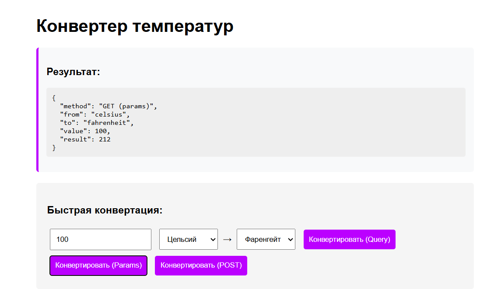

# Конвертер температур

### Основные возможности:
3 способа передачи данных:
-GET с query параметрами
-GET с параметрами пути
-POST с JSON телом
-CRUD операции для истории конвертаций
-Логгирование всех запросов

### Поддерживаемые единицы измерения:
- Цельсий (°C)
- Фаренгейт (°F)
- Кельвин (K)